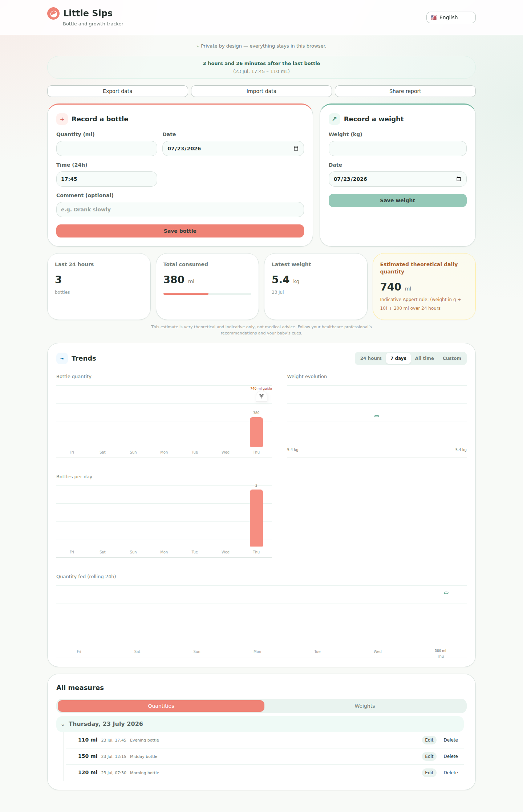
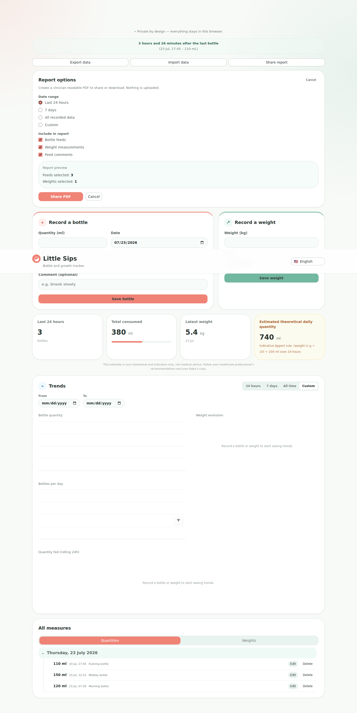
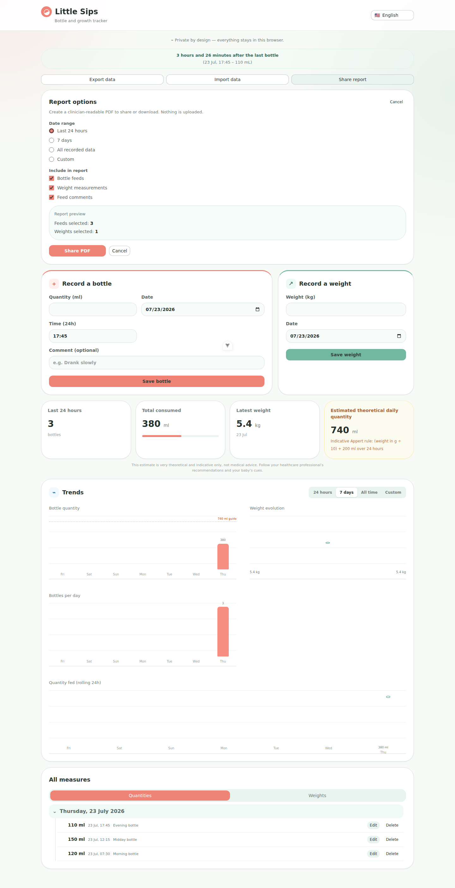
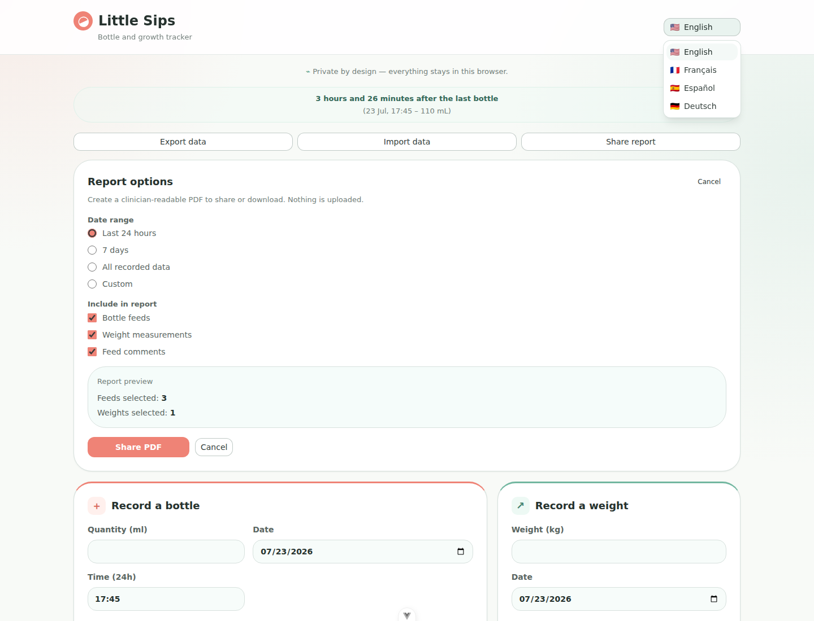

# Little Sips user guide

Little Sips helps you record bottle feeds and weight measurements, spot recent
patterns, and prepare a shareable record for a clinician. It works locally in
your browser by default. Open it online once and wait for **Ready to reopen
offline** before relying on offline reopening.

> **Privacy first:** local records are erased if you clear this site's browser
> data. Export your data regularly, or use optional cloud sync when it is
> available.

## Start recording

Use **Record a bottle** to enter the quantity in millilitres, date, 24-hour
time, and an optional note. Select **Save bottle** when you are done.

Use **Record a weight** to enter a weight in kilograms and its measurement
date, then select **Save weight**.

After saving, the **Last 24 hours** cards show the bottle count, total
consumed, and latest weight. Once a weight is present, Little Sips also shows a
theoretical daily quantity using the Appert rule. This is only an indicative
guide, not medical advice—follow your healthcare professional's advice and
your baby's cues.

## Review trends and records

The **Trends** section has four time ranges:

- **24 hours** for recent activity;
- **7 days** for the previous week;
- **All time** for every saved record; and
- **Custom** to choose a start and end date.

It displays bottle quantity, weight evolution, bottles per day, and rolling
24-hour quantity where data is available.

The **All measures** section keeps records grouped by day. Switch between
**Quantities** and **Weights**, expand a day as needed, and use **Edit** or
**Delete** beside a record to correct it.

## Back up and restore data

Select **Export data** to download a versioned JSON recovery backup of the
currently accessible history, including deleted records, pending changes, and
both versions of unresolved conflicts. It contains no sign-in credentials and
does not expose another signed-out account's hidden history. Keep this file
somewhere safe: anyone with the file can read its health records.

To restore a backup, select **Import data** and choose its JSON file. Imported
records are merged rather than replacing existing history. Older unversioned
exports are also accepted. Restoration is local and works without a backend;
importing a file never grants family access or starts an upload.

## Create a clinician-ready PDF

Select **Share report** to open the report options. Choose a date range
(last 24 hours, seven days, all data, or a custom range), then choose whether
to include bottle feeds, weight measurements, and comments. The preview shows
how many records will be included.

Select **Share PDF** to create a PDF in the browser. Depending on your device,
you can share it through the system share sheet or download it. Report
generation stays on your device; it does not upload the selected data.
If a known conflict changes the report's selected dates, categories, or values,
resolve it before creating the PDF. Unrelated conflicts do not block a report.
An offline report uses the history already on this device, not a guarantee
that the other parent's latest changes have arrived.

## Change language

Open **Language** in the header and choose **English**, **Français**,
**Español**, or **Deutsch**. The interface changes immediately.

## Optional cloud sync

Open **Share with another parent** if the administrator has configured the
service. Use **Continue with Google** or **Continue with Microsoft**, then
**Create a family**. This creates an empty shared history for one baby, with
space for two parents. An account belongs to at most one family.

The creator selects **Invite the other parent** and sends the private link by
their own messaging app. The second parent opens it, signs in, and selects
**Accept invitation**. The link is single-use and expires; the creator can
cancel it. Treat it as a secret until it has been used or cancelled.

Before existing local records enter the shared history, the app asks for your
confirmation. Both parents can add, correct, and delete individual records.
Changes save locally first and upload when authenticated and connected.
Leave the app open to receive updates; **Sync now** requests them immediately.
Closed or suspended apps do not continuously synchronize.

If both devices change the same record, **Choose which changes to keep**
shows both versions, including deletion. Select the version you want. Neither
version is silently discarded.

Signing out hides downloaded family history but retains unsent changes for
that same account on this device. Export a backup before clearing browser
data. A temporary network outage or expired login does not prevent recording
into already-downloaded history.

Only the creator can remove the other parent or delete the shared family.
The invited parent can leave. Removing access cannot erase copies already
downloaded on somebody else's device.

Without a configured sign-in service, Little Sips remains fully functional in
local-only mode and makes no cloud requests. If configuration is removed after
you used sharing, downloaded history remains accessible unless you signed out.
When sharing becomes available again, review your records and explicitly
resume before uploading.

## Offline access and updates

The first visit needs a connection. On a production deployment, wait for
**Ready to reopen offline**: the app and its PDF-generation code are then
cached for later visits. A browser may evict this cache or local storage, so
offline access is not a substitute for backups.

When an app update is available, finish or clear any unfinished bottle or weight
form, then select **Save and reload**. The app does not force an update while
you are entering records.
